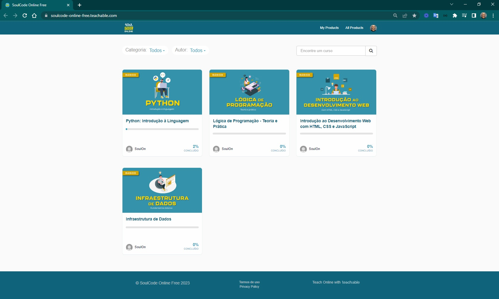

## SoulCode Online

O conteúdo do [SoulCode Online](https://soulcode-online-free.teachable.com/) está separado em quatro títulos muito interessantes subdivididos em tópicos importantes.

   

 

A seguir temos os tópicos apresentados no  [Introdução da SoulCode](https://soulcode.com/processo-seletivo/candidato/minicurso/La2WdRZCvY0uHPv0Jv86) está separado em quatro títulos muito interessantes subdivididos em tópicos importantes.

### Introdução

- 1. Conceito de Sistema Computacional
- Computadores Analógicos x Digitais
- Evolução Tecnológica: Gerações dos Computadores
- Componentes Básicos de um Sistema C
- Bases e sistemas de numeração
- Conversão de Bases
- Conversão de Decimal para Binário
- Conversão de Binário para Decimal
- Funções e Portas Lógica
- Porta XOR (OU exclusivo)
- Outras Portas Lógicas e Circuitos C
- ITIL, História, ITIL V2, ITIL V3 e ITIL V4
- O que é HTML?
- Vamos criar nossa primeira página!
- O que mais podemos fazer com HTML?
- Introduzindo o CSS

## Desenvolvedor Servicenow

O [Desenvolvedor Servicenow](https://soulcode.com/curso-desenvolvedor-servicenow) é um conjunto de Bootcamps Digitais são cursos online e ao vivo, com o objetivo de capacitar os alunos, criando a oportunidade de iniciar ou reciclar uma nova profissão no mercado de tecnologia. Este bootcamp é ideal para pessoas que desejam entrar no mundo de ServiceNow, uma plataforma de software baseada em nuvem e estruturada sobre conceitos de ITIL, que oferece suporte à transformação digital, permitindo o autoatendimento e a automação de processos de ponta a ponta, além de facilitar a integração entre diferentes setores de uma empresa. Nossa metodologia tem uma abordagem que vai da formação ao emprego, capacitando os alunos na parte técnica, nas habilidades interpessoais e no direcionamento de carreira com ferramentas digitais mais usadas em grandes empresas globalmente.

### O que você irá aprender

O profissional que atuará com ServiceNow, vai ser capacitado para desenvolver soluções técnicas e implementar o desenvolvimento em diversos tipos de clientes e cenários. Habilidades como o desenvolvimento de flows, criação de formulários para incidentes e requisições, virtual agent, catálogo de serviços, regras de negócios e portal de serviços serão abordados ao longo do curso. Será ministrado também o ensino de conceitos teóricos à volta de TI como ITIL e conhecimentos técnicos centralizados no desenvolvimento voltado para ServiceNow.

### Plano

- 1. HTML e CSS
- Linguagem HTML5
- Elementos da página
- Tabelas
- Formulários
- CSS inline
- Formatação de elementos
- Layout de página
- Designer responsivo

- 2. JavaScript
- Variáveis e tipos primitivos: números, strings, date e objects
- Tipo de Arrays
- Operadores lógicos e matemáticos
- Operadores de comparação
- Condições IF/Else
- Loops
- Funções e parametros
- Funções anônimas e Arrow Fuctions
- Eventos do DOM

- 3. ITIL
- Introdução ao ITIL 4
- Gestões de serviços e suas dimensões
- Sistema de valor (SVS)
- Cadeia de valor de serviço
- Principais Orientadores do framework ITIL
- Melhores práticas de gerenciamentos de serviços

- 4. SERVICENOW FUNDAMENTALS
- ServiceNow Studio
- Interface do usuário e navegação
- Catálogo de seviços e suas dimensões
- Auto atendimento e automoção de processos
- Formulários
- Usuários e Grupos e Roles

- 5. SERVICENOW ADMIN
- Introdução ao Scripting em Servicenow
- Importação de dados
- Notificações
- Portal de serviços
- Flow Designer
- SLA
- Introdução ao CMDB
- Framework de testes automatizados (ATF)

- 6. Projeto Final
Trabalho em grupo onde os alunos são dividos em squads de trabalho
Desenvolvimento de um projeto final, baseado em um desafio estabelecido pelos nossos parceiros contratantes, que tem por objetivo aplicar todos os ensinamentos do curso para resolver um problema de negócio real.